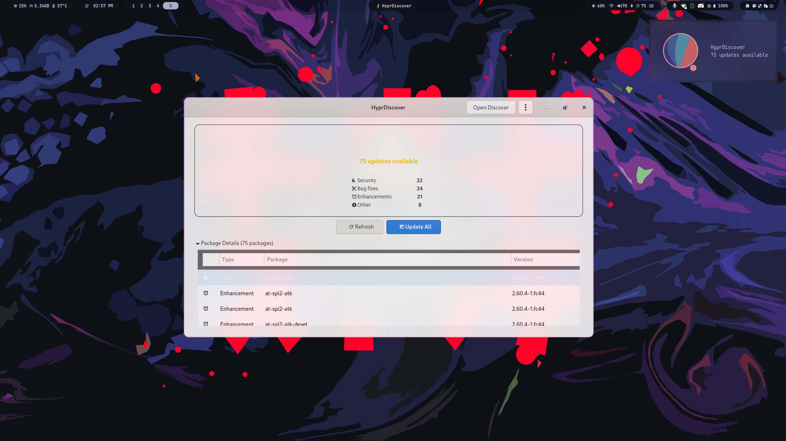

# HyprDiscover

Software guidance for Fedora users.

HyprDiscover helps you understand what to install, which source to
choose, how to update safely, and how to remove software cleanly —
all from a lightweight GTK4 interface.

---

## Screenshot



---

## What makes HyprDiscover different?

| Tool | Approach |
|------|----------|
| **KDE Discover** | App store — browse thousands of applications |
| **GNOME Software** | App store — ratings, reviews, screenshots |
| **HyprDiscover** | Software advisor — explains *why* and recommends *which* |

HyprDiscover doesn't show you everything.
It shows you what matters.

---

## Features

- **GTK4 + Libadwaita** graphical interface
- **Summary card** — total updates, security, bug fixes, enhancements at a glance
- **Sortable package table** with checkboxes for selective updates
- **Real-time progress streaming** during updates
- **Cancel update** operation
- **Preferences window** — 6 configurable settings with instant-save
- **Typed error classification** — Network, Auth, Lock, Conflict, Internal
- **XDG autostart** integration (opt-in via Preferences)
- **Accessibility labels** on controls, tooltips on action buttons
- **PackageKit integration** — update detection and installation
- **Update log viewer** — expandable transaction details
- **Reboot button** — appears after successful updates
- **Waybar integration** — JSON output mode (`--waybar`) with update count indicator
- **CLI status output** — `--status` and `--status --json` modes
- **Background update checking** — `--check` mode for systemd timer
- **Single-instance launcher** — shell wrapper with Hyprland focuswindow
- **Desktop notifications** — via `notify-send`
- **Configuration file** — TOML at `~/.config/hyprdiscover/config.toml`
- **Structured logging** — Python stdlib logging to stderr
- **Desktop entry** — application menu integration
- **SVG icon** — scalable application icon
- **CSS stylesheet** — GTK4 CSS provider for theming
- **Installation script** — quick user-space install to `~/.local/`

---

## Why HyprDiscover?

Fedora users face a fragmented packaging ecosystem. RPM, Flatpak,
COPR, and AppImage each have different characteristics — and users are
expected to understand them all.

HyprDiscover removes the guesswork by guiding you toward the right
software decisions, with explanations you can understand.

The project focuses on:

- Guidance over catalog
- Fedora integration
- Performance and simplicity
- Lightweight — no DE dependency

---

## Technology Stack

### User Interface

- Python 3.12+
- GTK4
- Libadwaita
- PyGObject

### Package Management

- PackageKit (via `pkcon` subprocess; native D-Bus planned for v0.6)

### System Integration

- systemd
- Polkit
- notify-send

### Desktop Integration

- Hyprland
- Waybar

---

## Installation

### Quick install (user-space)

```bash
git clone https://github.com/Zirosaur/HyprDiscover.git
cd HyprDiscover
chmod +x install.sh
./install.sh
```

Launch:

```bash
hyprdiscover
```

### Development install (pip)

Backend / CI development (pure Python, no GTK dependencies):

```bash
git clone https://github.com/Zirosaur/HyprDiscover.git
cd HyprDiscover
pip install -e ".[dev]"
```

GTK development (includes PyGObject for the graphical interface):

```bash
pip install -e ".[dev,gtk]"
```

Run:

```bash
hyprdiscover              # GUI
hyprdiscover --waybar     # Waybar JSON output
hyprdiscover --status     # CLI status summary
hyprdiscover --status --json  # CLI status (JSON output)
python -m hyprdiscover    # Alternative entry point
```

Dependencies: `python3-gobject`, `gtk4`, `libadwaita`, `PackageKit`,
`libnotify`, `nerd-fonts` (or any font with Nerd Font glyphs for icons).

---

## Waybar Integration

Add the following module to your Waybar configuration:

```json
"custom/updates": {
    "exec": "hyprdiscover --waybar",
    "return-type": "json",
    "format": "{}",
    "on-click": "hyprdiscover",
    "interval": 3600,
    "tooltip": true
}
```

Reload Waybar:

```bash
pkill waybar && waybar &
```

HyprDiscover provides a native Waybar output mode with JSON-formatted
update counts and does not require external update scripts.

---

## CLI Status Output

Check for available updates from the command line:

```bash
hyprdiscover --status
```

Example output:

```
Updates available: 12

Security: 2
Bug Fix: 5
Enhancement: 3
Other: 2

Last checked: 2026-06-03 12:45
```

Up-to-date systems show:

```
System up to date
Last checked: 2026-06-03 12:45
```

For automated scripts and integrations, use JSON output:

```bash
hyprdiscover --status --json
```

```json
{"up_to_date": false, "updates_available": 12, "security": 2, "bugfix": 5, "enhancement": 3, "other": 2, "last_checked": "2026-06-03T12:45:00"}
```

Exit codes:

- `0` — successful check (updates found or system up to date)
- `1` — error (unable to check for updates)

---

## Background Update Checking

HyprDiscover can periodically check for updates in the background using
a systemd user timer. When updates are available, a desktop notification
is sent.

### Enable the timer

```bash
# Install the systemd units
mkdir -p ~/.config/systemd/user/
cp assets/systemd/hyprdiscover-check.service ~/.config/systemd/user/
cp assets/systemd/hyprdiscover-check.timer ~/.config/systemd/user/
systemctl --user daemon-reload

# Enable and start the timer
systemctl --user enable --now hyprdiscover-check.timer
```

### Check timer status

```bash
systemctl --user status hyprdiscover-check.timer
systemctl --user list-timers
```

### Configuration

Background checking respects the following settings in
`~/.config/hyprdiscover/config.toml`:

```toml
[hyprdiscover]
auto_refresh = true            # Enable background checks
refresh_interval_minutes = 60  # Sync with timer OnUnitActiveSec
show_notifications = true      # Show desktop notifications
```

The timer runs every 60 minutes by default. To change the interval,
edit the timer unit:

```bash
systemctl --user edit hyprdiscover-check.timer
```

---

## Security

HyprDiscover never runs as root.

Administrative operations are delegated to:

- PackageKit
- Polkit
- systemd Offline Updates (planned)

This follows Fedora's recommended update workflow and minimizes privilege
escalation risks.

For more information see:

- SECURITY.md
- ARCHITECTURE.md

---

## Project Documentation

Additional documentation is available:

- PRD.md — product requirements
- ARCHITECTURE.md — architecture overview
- SECURITY.md — security model
- ROADMAP.md — planned releases
- CONTRIBUTING.md — contribution guide

---

## Target Platforms

### Primary Target

- Fedora Linux
- Hyprland

### Future Compatibility

- Sway
- Niri
- River
- Other Wayland compositors

---

## Status

Current development stage: **v0.4.0**

Implemented:

- GTK4 interface with HeaderBar
- Summary card with category breakdown
- Sortable four-column package table with checkboxes
- Selective package updates (Update Selected / Update All)
- PackageKit integration (pkcon backend)
- Update detection with NEVRA parsing
- Real-time progress streaming
- Transaction log viewer (expandable)
- Cancel update operation
- Reboot integration with confirmation dialog
- Configuration GUI (Preferences window with instant-save)
- Typed error classification (Network, Auth, Lock, Conflict, Internal)
- XDG autostart integration (opt-in via Preferences)
- About dialog, desktop entry, SVG icon
- Waybar JSON output mode
- CLI status output (--status, --status --json)
- Background update checking (--check, systemd timer)
- Single-instance launcher
- Desktop notifications
- Accessibility labels and tooltips
- Configuration file (TOML)
- Structured logging
- CSS stylesheet for theming
- Test infrastructure (86 unit tests, 44% coverage)
- CI pipeline (pytest, ruff, mypy, Fedora GTK container)
- RPM packaging spec (COPR-ready)
- Modular architecture (models → backends → services → ui)

### Planned Features

#### v0.5 — Flatpak Integration

- Flatpak support via `PackageManagerBackend` ABC
- Unified RPM + Flatpak update view
- Source column showing where each package originates

#### v0.6 — Recommendation Engine

- Flatpak vs RPM recommendation logic
- COPR trust indicators
- Update discrepancy explanations
- Native PackageKit D-Bus backend

#### v0.7 — Software Discovery

- Package search across sources
- Install/uninstall via PackageKit + Flatpak
- Installed-software inventory

#### v1.0

- Stable software guidance tool for Fedora
- COPR package + Flathub submission

---

## License

HyprDiscover is licensed under the GNU General Public License v3.0 (GPLv3).

See the LICENSE file for the full license text.

---

## Contributing

Contributions, bug reports, feature requests, and pull requests are welcome.

Please read CONTRIBUTING.md before submitting changes.

---

## Acknowledgements

HyprDiscover was created to help Fedora users make informed software
decisions without becoming packaging experts.

It started as an update manager for Hyprland. It's growing into a
software guidance tool for anyone running Fedora.
